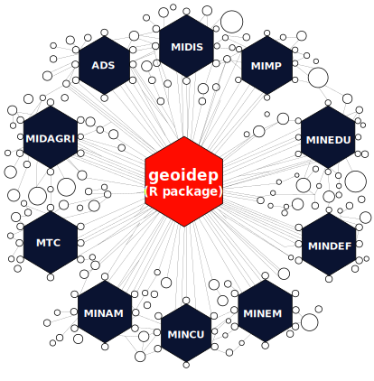

<!-- README.md is generated from README.Rmd. Please edit that file -->

```{r, include = FALSE}
knitr::opts_chunk$set(
  collapse = TRUE,
  comment = "#>",
  fig.path = "man/figures/fig-",
  out.width = "100%",
  dpi = 300
)
```

# geoidep


<!-- badges: start -->
[](https://github.com/ambarja/geoidep/actions/workflows/R-CMD-check.yaml)
[](https://lifecycle.r-lib.org/articles/stages.html#experimental)
[](https://codecov.io/github/ambarja/geoidep)
[](https://app.codecov.io/gh/ambarja/geoidep)
<!-- badges: end -->

The goal of **geoidep**📦 is to offers R users an easy and accessible way to obtain official cartographic data on various topics, such as **society** 🏛️, **transport**🚗, **environment**🌱, **agriculture**🌾, **climate**⛅️,among others.

This includes information provided by regional government entities and technical-scientific institutions, managed by the **Spatial Data Infrastructure of Peru**.



## Installation

You can install the development version of geoidep like so:

```r
install.packages('pak')
pak::pkg_install('ambarja/geoidep')
```

or also the official version available on CRAN:

```r
install.packages('geoidep')
```


## Example 01: Introduction

```{r}
library(geoidep)
```

In this example, we can identify the list of providers available in geoidep and the layers they present.

```{r}
get_data_sources() |> 
  head()
```
In summary the suppliers and the number of available layers

```{r}
get_providers() 
```

## Example 02: Download official INEI administrative boundaries

This is a simple example of how to download Peru's official administrative boundaries:

```{r}
dep <- get_departaments(show_progress = FALSE)
```

The first 10 rows of the original data are displayed here:
```{r}
head(dep)
```

## Example 03: Working with Gebosque data

```{r warning=FALSE,message=FALSE}
library(tidyverse)
```
This is another example of how to obtain historical forest loss data according to a given administrative boundary.

```{r}
loreto <- dep |> filter(NOMBDEP == "LORETO")
historico <- get_forest_loss_data(
  layer = "stock_bosque_perdida_departamento",
  ubigeo = loreto[["CCDD"]],
  show_progress = FALSE)
```


```{r timeserie,fig.align='center',out.height=200}
historico |> 
  ggplot(aes(x = anio,y = perdida )) + 
  geom_point(size = 2) + 
  geom_line(linewidth =1) + 
  theme_minimal() + 
  labs(
    title = "Pérdida de bosque del departamento de Loreto \ndurante los años 2001 - 2023",
    caption = "Fuente: Geobosque")
```
