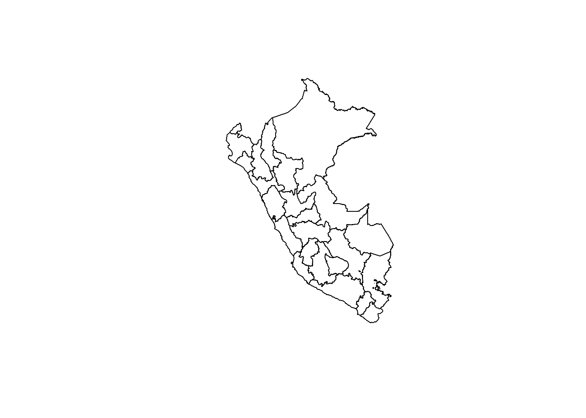
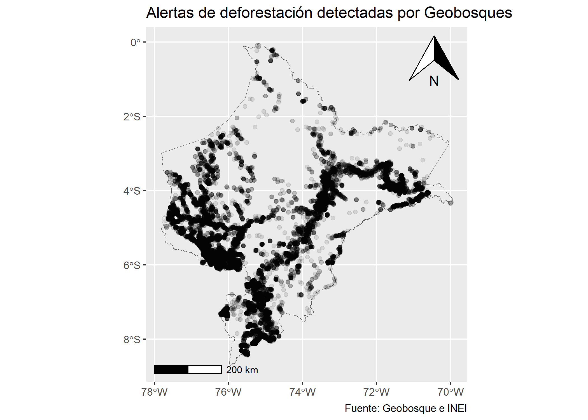
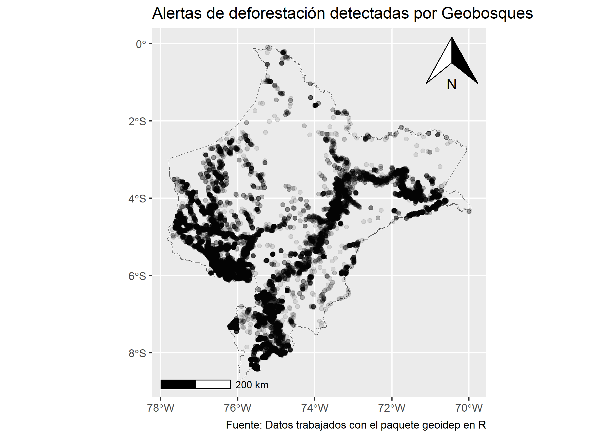

<!-- README.md is generated from README.Rmd. Please edit that file -->

# geoidep


<!-- badges: start -->

[](https://github.com/ambarja/geoidep/actions/workflows/R-CMD-check.yaml)
[](https://lifecycle.r-lib.org/articles/stages.html#experimental)
[](https://codecov.io/github/ambarja/geoidep)
<!-- badges: end -->

The goal of **geoidep**📦 is to offers R users an easy and accessible
way to obtain official cartographic data on various topics, such as
**society** 🏛️, **transport**🚗, **environment**🌱, **agriculture**🌾,
**climate**⛅️,among others.

This includes information provided by regional government entities and
technical-scientific institutions, managed by the **Spatial Data
Infrastructure of Peru**.

## Installation

You can install the development version of geoidep like so:

``` r
install.packages('pak')
pak::pkg_install('ambarja/geoidep')
```

or also the official version available on CRAN:

``` r
install.packages('geoidep')
```

## Example 01: Introducction

``` r
library(geoidep)
#> 
#> ── Welcome to geoidep ──────────────────────────────────────────────────────────
#> ℹ geoidep is a wrapper that allows you to download cartographic data for Peru from R.
#> Currently, `geoidep` supports the following providers:
#> ✔ Geobosque
#> ✔ INEI
#> ✔ Midagri
#> ✔ Sernanp
#> ℹ For more information, please use the `get_data_sources()` function.
```

In this example, we can identify the list of providers available in
geoidep and the layers they present.

``` r
get_data_sources() |> 
  head()
#> # A tibble: 6 × 7
#>   provider category    layer           layer_can_be_actived admin_en year  link 
#>   <chr>    <chr>       <chr>           <lgl>                <chr>    <chr> <chr>
#> 1 INEI     General     departamento    TRUE                 Nationa… 2019  http…
#> 2 INEI     General     provincia       TRUE                 Nationa… 2019  http…
#> 3 INEI     General     distritos       TRUE                 Nationa… 2019  http…
#> 4 Midagri  Agriculture vegetation_cov… TRUE                 Ministr… 2018  http…
#> 5 Midagri  Agriculture agriculture_se… TRUE                 Ministr… 2024  http…
#> 6 Midagri  Agriculture oil_palm_areas  TRUE                 Ministr… 2016… http…
```

In summary the suppliers and the number of available layers

``` r
get_providers() 
#> # A tibble: 4 × 2
#>   provider  layer_count
#>   <fct>           <int>
#> 1 Geobosque           5
#> 2 INEI                3
#> 3 Midagri             4
#> 4 Sernanp            61
```

## Example 02: Integration with R spatial ecosystem

``` r
library(sf)
```

This is a simple example of how to download Peru’s official
administrative boundaries:

``` r
dep <- get_departaments(show_progress = FALSE)
```

The first 10 rows of the original data are displayed here:

``` r
head(dep)
#> Simple feature collection with 6 features and 6 fields
#> Geometry type: MULTIPOLYGON
#> Dimension:     XY
#> Bounding box:  xmin: -79.45857 ymin: -17.28501 xmax: -70.80408 ymax: -2.986125
#> Geodetic CRS:  WGS 84
#>   id OBJECTID CCDD   NOMBDEP SHAPE_Length SHAPE_Area
#> 1  1        1   01  AMAZONAS    13.059047   3.199147
#> 2  2        2   02    ANCASH    11.788249   2.954697
#> 3  3        3   03  APURIMAC     7.730154   1.765933
#> 4  4        4   04  AREQUIPA    17.459435   5.330125
#> 5  5        5   05  AYACUCHO    17.127166   3.643705
#> 6  6        6   06 CAJAMARCA    12.540288   2.688386
#>                             geom
#> 1 MULTIPOLYGON (((-77.81399 -...
#> 2 MULTIPOLYGON (((-77.64697 -...
#> 3 MULTIPOLYGON (((-73.74655 -...
#> 4 MULTIPOLYGON (((-71.98109 -...
#> 5 MULTIPOLYGON (((-74.34843 -...
#> 6 MULTIPOLYGON (((-78.70034 -...
```

Simple visualization

``` r
plot(st_geometry(dep))
```



## Example 03: Integration with tidyverse

``` r
library(tidyverse)
```

This is another example of how to obtain historical forest loss data
according to a given administrative boundary.

``` r
loreto <- dep |> filter(NOMBDEP == "LORETO")
historico <- get_forest_loss_data(
  layer = "stock_bosque_perdida_departamento",
  ubigeo = loreto[["CCDD"]],
  show_progress = FALSE)
```

``` r
historico |> 
  ggplot(aes(x = anio,y = perdida )) + 
  # geom_bar(stat = "identity") + 
  geom_line(linewidth =1) + 
  theme_minimal() + 
  labs(
    title = "Pérdida de bosque durante los años 2001 - 2023",
    caption = "Fuente: Datos trabajados con el paquete geoidep en R")
```



Also, geoidep allows to obtain the deforestation alert points identified
in the last week by Geobosque.

``` r
alerta_deforestacion <- loreto |> 
  get_early_warning(sf = TRUE,show_progress = F)
```

``` r
ggplot() + 
  geom_sf(data = loreto,alpha = 0) + 
  geom_sf(data = alerta_deforestacion, alpha = 0.1) +
  labs(title = "Alertas de deforestación detectadas por Geobosques",
       caption = "Fuente: Datos trabajados con el paquete geoidep en R") + 
  ggspatial::annotation_north_arrow(location = "tr") + 
  ggspatial::annotation_scale()
```


