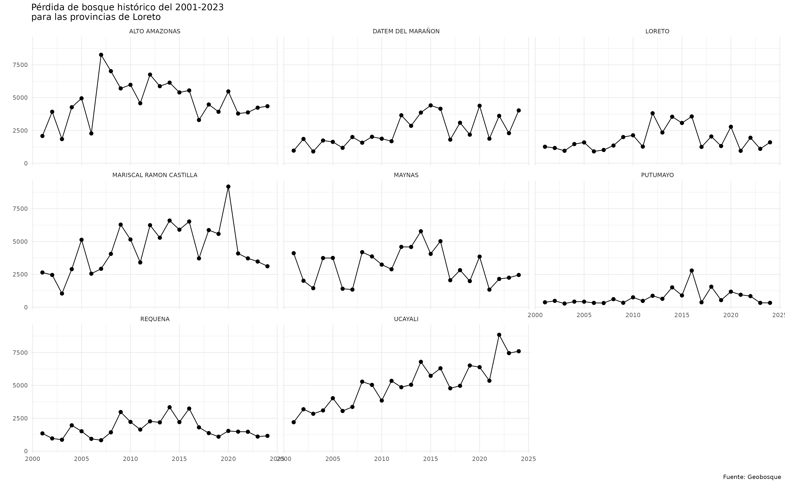

# Introduction to geoidep

## 1. Introduction

This package aims to provide R users with a new way of accessing
official Peruvian cartographic data on various topics that are managed
by the country’s Spatial Data Infrastructure.

By offering a new approach to accessing this official data, both from
technical-scientific entities and from regional and local governments,
it facilitates the automation of processes, thereby optimizing the
analysis and use of geospatial information across various fields.

**However, this project is still under construction, for more
information you can visit the GitHub official repository
<https://github.com/ambarja/geoidep>.**

If you want to support this project, you can support me with a coffee
for my programming moments.

## 2. Package installation

``` r
install.packages("geoidep")
```

Also, you can install the development version as follows:

``` r
install.packages('pak')
pak::pkg_install('ambarja/geoidep')
```

``` r
library(geoidep)
```

## 3. Basic usage

``` r
providers <- get_data_sources()
providers
#> # A tibble: 82 × 7
#>    provider  category   layer layer_can_be_actived admin_en year  link_geoportal
#>    <chr>     <chr>      <chr> <lgl>                <chr>    <chr> <chr>         
#>  1 INEI      General    depa… TRUE                 Nationa… 2019  https://ide.i…
#>  2 INEI      General    prov… TRUE                 Nationa… 2019  https://ide.i…
#>  3 INEI      General    dist… TRUE                 Nationa… 2019  https://ide.i…
#>  4 Midagri   Agricultu… agri… TRUE                 Ministr… 2024  https://siea.…
#>  5 Midagri   Agricultu… oil_… TRUE                 Ministr… 2016… https://siea.…
#>  6 Geobosque Forest     stoc… FALSE                Ministr… 2001… https://geobo…
#>  7 Geobosque Forest     stoc… TRUE                 Ministr… 2001… https://geobo…
#>  8 Geobosque Forest     stoc… TRUE                 Ministr… 2001… https://geobo…
#>  9 Geobosque Forest     stoc… TRUE                 Ministr… 2001… https://geobo…
#> 10 Geobosque Forest     warn… TRUE                 Ministr… last… https://geobo…
#> # ℹ 72 more rows
```

``` r
layers_available <- get_providers()
layers_available
#> # A tibble: 9 × 2
#>   provider  layer_count
#>   <fct>           <int>
#> 1 Geobosque           5
#> 2 INAIGEM             5
#> 3 INEI                7
#> 4 Midagri             2
#> 5 MTC                26
#> 6 Senamhi             1
#> 7 Serfor              1
#> 8 Sernanp            31
#> 9 SIGRID              4
```

## 4. Download Official Administrative Boundaries by INEI

``` r
# Region boundaries download 
loreto_prov <- get_provinces(show_progress = FALSE) |> 
  subset(nombdep == 'LORETO')
```

``` r
library(leaflet)
#> 
#> Attaching package: 'leaflet'
#> The following object is masked _by_ '.GlobalEnv':
#> 
#>     providers
library(sf)
#> Linking to GEOS 3.12.1, GDAL 3.8.4, PROJ 9.4.0; sf_use_s2() is TRUE
loreto_prov |> 
  leaflet() |> 
  addTiles() |> 
  addPolygons()
```

``` r
# Defined Ubigeo 
loreto_prov[["ubigeo"]] <- paste0(loreto_prov[["ccdd"]],loreto_prov[["ccpp"]])
```

``` r
# The first five rows
head(loreto_prov)
#> Simple feature collection with 6 features and 6 fields
#> Geometry type: MULTIPOLYGON
#> Dimension:     XY
#> Bounding box:  xmin: -76.89454 ymin: -8.715191 xmax: -69.94904 ymax: -0.63937
#> Geodetic CRS:  WGS 84
#>     ccdd ccpp                nombprov                     fuente nombdep
#> 138   16   01                  MAYNAS V Censo Nacional Economico  LORETO
#> 139   16   02           ALTO AMAZONAS V Censo Nacional Economico  LORETO
#> 140   16   03                  LORETO V Censo Nacional Economico  LORETO
#> 141   16   04 MARISCAL RAMON CASTILLA V Censo Nacional Economico  LORETO
#> 142   16   05                 REQUENA V Censo Nacional Economico  LORETO
#> 143   16   06                 UCAYALI V Censo Nacional Economico  LORETO
#>                               geom ubigeo
#> 138 MULTIPOLYGON (((-75.24086 -...   1601
#> 139 MULTIPOLYGON (((-76.30752 -...   1602
#> 140 MULTIPOLYGON (((-75.74592 -...   1603
#> 141 MULTIPOLYGON (((-72.08996 -...   1604
#> 142 MULTIPOLYGON (((-73.42087 -...   1605
#> 143 MULTIPOLYGON (((-74.82778 -...   1606
```

## 5. Working with Geobosque data

``` r
my_fun <- function(x){
  data <- get_forest_loss_data(
    layer = 'stock_bosque_perdida_provincia',
    ubigeo = loreto_prov[["ubigeo"]][x],
    show_progress = FALSE )
  return(data)
}
historico_list <- lapply(X = 1:nrow(loreto_prov),FUN = my_fun)
historico_df <- do.call(rbind.data.frame,historico_list)
```

``` r
# The first five rows
head(historico_df)
#>   anio perdida rango1 rango2 rango3  rango4  rango5 tipobosque ubigeo
#> 1 2001 4111.92      0      0 288.54 1387.08 2436.30          1   1601
#> 2 2002 2014.02      0      0 101.34  538.83 1373.85          1   1601
#> 3 2003 1448.01      0      0  60.66  386.91 1000.44          1   1601
#> 4 2004 3741.39      0      0 139.59 1344.51 2257.29          1   1601
#> 5 2005 3749.40      0      0 266.94 1213.38 2269.08          1   1601
#> 6 2006 1405.44      0     59  43.38  347.31  955.75          1   1601
```

## 6. Simple visualization with ggplot

``` r
library(ggplot2)
library(dplyr)
#> 
#> Attaching package: 'dplyr'
#> The following objects are masked from 'package:stats':
#> 
#>     filter, lag
#> The following objects are masked from 'package:base':
#> 
#>     intersect, setdiff, setequal, union
historico_df |> 
  inner_join(y = loreto_prov,by = "ubigeo") |> 
  ggplot(aes(x = anio,y = perdida)) + 
  geom_point(size = 1) + 
  geom_line() + 
  facet_wrap(nombprov~.,ncol = 3) + 
  theme_minimal(base_size = 5) + 
  labs(
    title = "Pérdida de bosque histórico del 2001-2023 \npara las provincias de Loreto",
    caption = "Fuente: Geobosque",
    x = "",
    y = "") 
```


