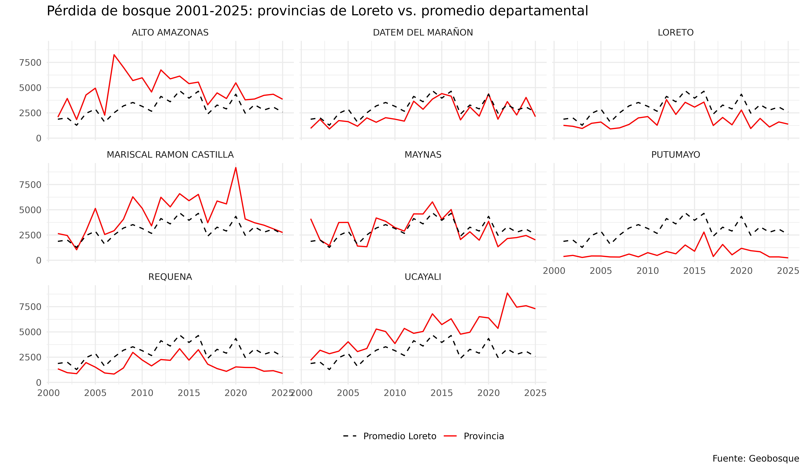

# Introduction to geoidep

## 1. Introduction

This package aims to provide R users with a new way of accessing
official Peruvian cartographic data on various topics that are managed
by the country’s Spatial Data Infrastructure.

By offering a new approach to accessing this official data, both from
technical-scientific entities and from regional and local governments,
it facilitates the automation of processes, thereby optimizing the
analysis and use of geospatial information across various fields.

**However, this project is still under construction, for more
information you can visit the GitHub official repository
<https://github.com/ambarja/geoidep>.**

If you want to support this project, you can support me with a coffee
for my programming moments.

## 2. Package installation

``` r

install.packages("geoidep")
```

Also, you can install the development version as follows:

``` r

install.packages('pak')
pak::pkg_install('ambarja/geoidep')
```

``` r

library(geoidep)
```

## 3. Basic usage

``` r

providers
#> # A tibble: 77 × 7
#>    provider  category   layer layer_can_be_actived admin_en year  link_geoportal
#>    <chr>     <chr>      <chr> <lgl>                <chr>    <chr> <chr>         
#>  1 INEI      General    depa… TRUE                 Nationa… 2019  https://ide.i…
#>  2 INEI      General    prov… TRUE                 Nationa… 2019  https://ide.i…
#>  3 INEI      General    dist… TRUE                 Nationa… 2019  https://ide.i…
#>  4 Geobosque Forest     stoc… FALSE                Ministr… 2001… https://geobo…
#>  5 Geobosque Forest     stoc… TRUE                 Ministr… 2001… https://geobo…
#>  6 Geobosque Forest     stoc… TRUE                 Ministr… 2001… https://geobo…
#>  7 Geobosque Forest     stoc… TRUE                 Ministr… 2001… https://geobo…
#>  8 Geobosque Forest     warn… TRUE                 Ministr… last… https://geobo…
#>  9 Sernanp   Enviroment anp_… TRUE                 Ministr… Not … https://geo.s…
#> 10 Sernanp   Enviroment zona… TRUE                 Ministr… Not … https://geo.s…
#> # ℹ 67 more rows
```

``` r

layers_available
#> # A tibble: 8 × 2
#>   provider         layer_count
#>   <fct>                  <int>
#> 1 Geobosque                  5
#> 2 INAIGEM                    5
#> 3 INEI                       7
#> 4 MapBiomas Alerta           1
#> 5 MTC                       26
#> 6 Senamhi                    1
#> 7 Serfor                     1
#> 8 Sernanp                   31
```

## 4. Download Official Administrative Boundaries by INEI

``` r

# Region boundaries download (done once in the setup chunk above)
head(loreto_prov, 3)
#> Simple feature collection with 3 features and 6 fields
#> Geometry type: MULTIPOLYGON
#> Dimension:     XY
#> Bounding box:  xmin: -76.89454 ymin: -6.14773 xmax: -72.11719 ymax: -0.63937
#> Geodetic CRS:  WGS 84
#>     ccdd ccpp      nombprov                     fuente nombdep
#> 138   16   01        MAYNAS V Censo Nacional Economico  LORETO
#> 139   16   02 ALTO AMAZONAS V Censo Nacional Economico  LORETO
#> 140   16   03        LORETO V Censo Nacional Economico  LORETO
#>                               geom ubigeo
#> 138 MULTIPOLYGON (((-75.24086 -...   1601
#> 139 MULTIPOLYGON (((-76.30752 -...   1602
#> 140 MULTIPOLYGON (((-75.74592 -...   1603
```

``` r

library(mapgl)
library(sf)
#> Linking to GEOS 3.12.1, GDAL 3.8.4, PROJ 9.4.0; sf_use_s2() is TRUE
maplibre_view(data = loreto_prov)
```

## 5. Working with Geobosque data

``` r

my_fun <- function(x){
  data <- get_forest_loss_data(
    layer = 'stock_bosque_perdida_provincia',
    ubigeo = loreto_prov[["ubigeo"]][x],
    show_progress = FALSE )
  return(data)
}
historico_list <- lapply(X = 1:nrow(loreto_prov),FUN = my_fun)
historico_df <- do.call(rbind.data.frame,historico_list)
```

``` r

# The first five rows
head(historico_df)
#> # A tibble: 6 × 8
#>    anio perdida rango1 rango2 rango3 rango4 rango5 ubigeo
#>   <int>   <dbl>  <dbl>  <dbl>  <dbl>  <dbl>  <dbl> <chr> 
#> 1  2001   4112.  2436.  1387.  289.     0        0 1601  
#> 2  2002   2014.  1374.   539.  101.     0        0 1601  
#> 3  2003   1448.  1000.   387.   60.7    0        0 1601  
#> 4  2004   3741.  2257.  1344.  140.     0        0 1601  
#> 5  2005   3749.  2269.  1213.  267.     0        0 1601  
#> 6  2006   1405.   956.   347.   43.4   58.7      0 1601
```

## 6. Simple visualization with ggplot

``` r

library(ggplot2)
library(dplyr)
#> 
#> Attaching package: 'dplyr'
#> The following objects are masked from 'package:stats':
#> 
#>     filter, lag
#> The following objects are masked from 'package:base':
#> 
#>     intersect, setdiff, setequal, union

historico_prov <- historico_df |>
  inner_join(y = loreto_prov, by = "ubigeo")

promedio_loreto <- historico_prov |>
  group_by(anio) |>
  summarise(perdida = mean(perdida), .groups = "drop")
```

``` r

ggplot(historico_prov, aes(x = anio, y = perdida)) +
  geom_line(aes(group = nombprov), color = "red", linewidth = 0.6) +
  geom_line(
    data = promedio_loreto,
    aes(linetype = "Promedio Loreto"),
    color = "black",
    linewidth = 0.6,
    linetype = "dashed"
    ) +
  scale_linetype_manual(name = NULL, values = c("Promedio Loreto" = "solid")) +
  facet_wrap(nombprov ~ .) +
  theme_minimal(base_size = 12) +
  theme(legend.position = "bottom") +
  labs(
    title = "Pérdida de bosque 2001-2025: provincias de Loreto vs. promedio departamental",
    caption = "Fuente: Geobosque",
    x = "",
    y = "")
#> Warning: No shared levels found between `names(values)` of the manual scale and the
#> data's linetype values.
```


